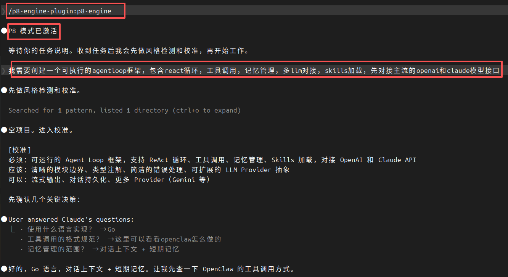
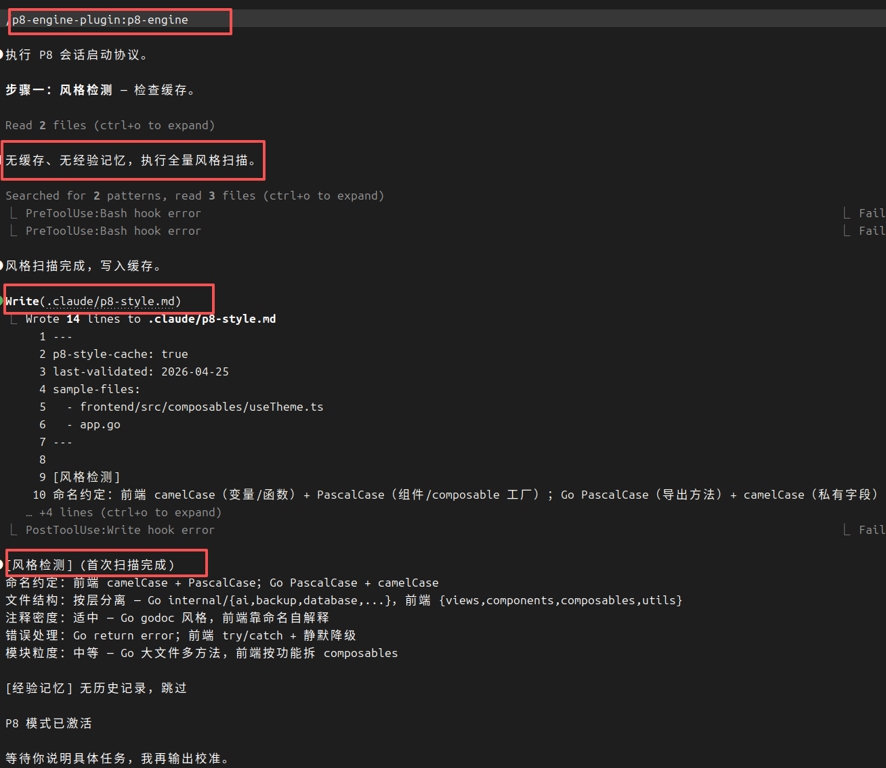
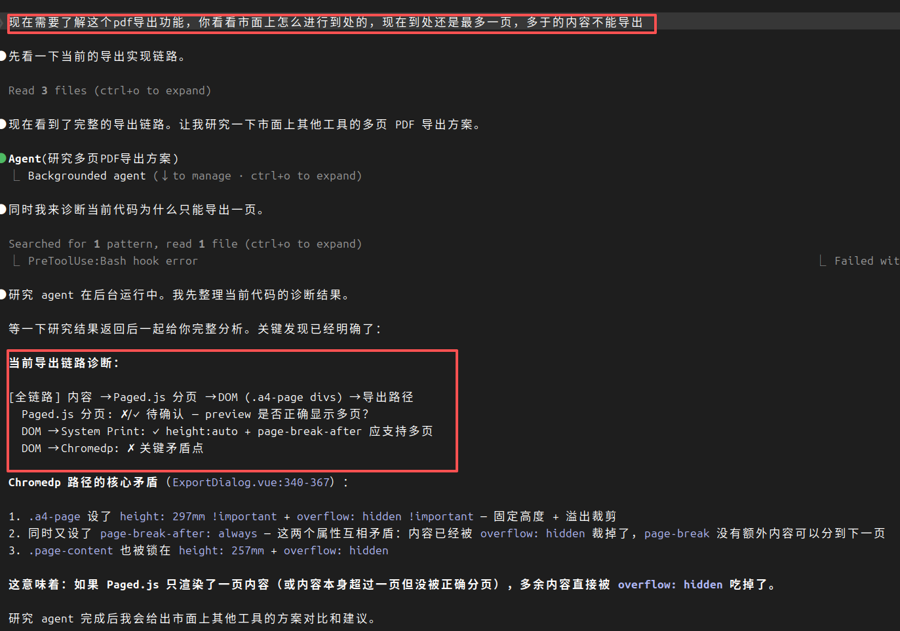
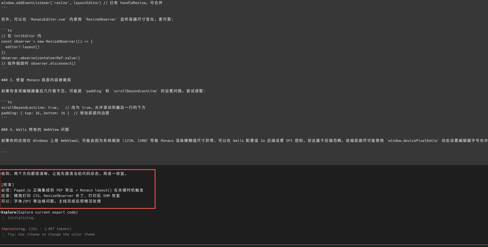
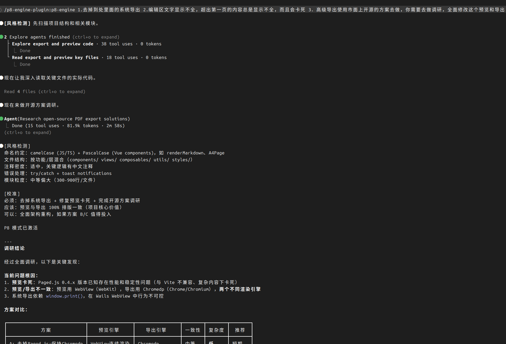

# P8 Engine

**工程方法论 + AI 记忆系统 —— 一个 plugin，两个 skills，全面提升 AI 编码质量。**

[中文](#中文) | [English](#english)

---

## 中文

### 这是什么

P8 Engine 是一个 [Claude Code](https://docs.anthropic.com/en/docs/claude-code) Plugin，包含两个 skills：

| Skill | 用途 | 触发方式 |
|-------|------|----------|
| **p8-engine** | 工程方法论 — 铁律、链路预判、行动后自检、全链路审视、能动性鞭策 | `/p8-engine` |
| **inject-memory** | 给任意项目注入轻量 AI 记忆系统 | `/inject-memory` |

### 安装

```bash
# 添加 marketplace
claude plugin marketplace add darven-cs/p8-engine

# 安装 plugin（一次安装，两个 skills 都可用）
claude plugin install p8-engine@p8-engine

# 激活（启动新会话后）
/p8-engine          # 激活工程方法论
/inject-memory      # 注入记忆系统到目标项目
```

---

### p8-engine：工程方法论

不是 prompt wrapper。是行为协议，让 AI 像 P8 工程师一样做事。

#### 核心机制

```
会话启动协议    风格检测 → 任务校准 → 链路预判 → 确认激活
核心铁律        穷尽方案 · 先查后问 · 主动延伸 · 全链路排查 · 精准修改 · 检查点意识
行动后自检      每个动作后立即验证 + 战果记录 + 能动性鞭策
质量自检        6 项通用 + 5 项代码 + 交付前全链路审视
应急流程        诊断卡壳 → 拉高视角 → 最小行动恢复 → 穷尽后结构化退出
模块开发        Phase 0-4：读 → 设计契约 → 自检 → 实现 → 验证
```

#### 它治什么病

| LLM 编码常见问题 | P8 Engine 怎么治 |
|-----------------|-----------------|
| 空口说"已完成"，不跑验证 | 战果记录：每个完成都必须有 build/test/curl 输出 |
| 修完 bug 就停，不检查同类 | 铁律三 + 行动后自检：同 root cause 范围内延伸排查 |
| 信息不足就问用户 | 铁律二：先用工具自查，只问真正需要确认的 |
| 只修当前报错，不看全链路 | 铁律四 + 链路预判 + 全链路审视：自底向上画依赖图 |
| 乱猜假设直接跑 | 铁律：有歧义先澄清，不代入假设 |
| 把 100 行写成 1000 行 | 质量自检：简洁性检查，不加未被要求的抽象 |
| 顺手改了无关代码 | 铁律五：精准修改，不做附带"改进" |
| 代码风格和项目格格不入 | 风格检测：开工前强制读现有代码 |
| 卡壳反复微调同一方案 | 应急流程：诊断 → 最小行动 → 渐进恢复 |
| 修完就停，不验证不延伸 | 能动性鞭策："端到端在哪？证据呢？" |
| 交付质量参差不齐 | 质量罗盘 + 全链路审视：交付前强制逐跳验证 |

---

### inject-memory：AI 记忆系统

解决一个核心问题：**AI 每次新会话都失忆**。上一次会话踩过的坑、做的设计决策、模块间的依赖关系——全忘了，下次从头踩。

#### 一键注入

```bash
cd /path/to/your-project
/inject-memory
```

注入后项目新增：

```
your-project/
├── memory/
│   ├── _index.md                    # 总索引（每次会话自动加载）
│   ├── _tutorial.md                 # 使用教程（可复制到新项目）
│   ├── modules/                     # 模块记忆
│   │   ├── overview.template.md     # 模块概览模板
│   │   ├── design.template.md       # 设计决策模板
│   │   ├── integration.template.md  # 接入方式模板
│   │   └── known_issues.template.md # 已知问题模板
│   ├── bugs/                        # 踩坑记录
│   │   └── bug.template.md          # 踩坑模板
│   └── progress/                    # 进度追踪
│       └── current-status.template.md
├── .claude/
│   ├── hooks/
│   │   ├── memory-preflight.mjs     # PreToolUse：改代码前自动提醒相关记忆
│   │   └── sync-memory-index.mjs    # PostToolUse：改记忆后自动同步索引日期
│   └── settings.json                # hook 注册
└── CLAUDE.md                        # 追加了记忆使用规范
```

#### 它怎么工作

**每次新会话启动时**：Claude 自动加载 `memory/_index.md`，感知项目全貌——有哪些模块、踩过哪些坑、当前进度是什么。

**每次改代码前**：PreToolUse hook 自动扫描 `_index.md`，找出和当前修改相关的记忆条目，输出关键约束提醒。不是被动等 AI 想起来，是 hook 主动喂给它。

**每次改记忆后**：PostToolUse hook 自动把 `_index.md` 对应条目的"最后更新"日期同步为今天。

**记忆不会丢**：结构化模板 + 索引 + hook 三件套，跨会话持久化。

#### 什么该记，什么不该记

| 该记（项目记忆） | 不该记 |
|-----------------|--------|
| 模块架构、接口、数据流 | 代码本身的细节（读代码就行） |
| 设计决策和**为什么**这样选 | 临时调试日志 |
| 踩过的坑（跨模块、代码看不出原因的） | 一次性脚本的用途 |
| 模块间依赖关系和集成点 | API 文档（外部链接即可） |
| 当前进度和未完成事项 | 已完成且不再相关的任务 |
| 环境特定的配置约束 | 通用编程知识 |

判断标准：**下次会话读到这条记忆，能不能避免重复犯错或重复调研？** 能 → 记。不能 → 不记。

#### 记忆目录结构

**模块记忆**（`memory/modules/`）—— 一个模块一份记忆，大模块用子目录：

```
modules/
├── auth/                          # 大模块 → 子目录
│   ├── overview.md                # 有什么类/接口/数据
│   ├── design.md                  # 为什么这样做
│   ├── integration.md             # 和其他模块怎么对接
│   └── known_issues.md            # 未修的坑
├── quick-utils.md                 # 小模块 → 单文件
└── ...
```

**踩坑记录**（`memory/bugs/`）—— 跨模块的通用坑：

```
bugs/
├── redis_cache-invalidation.md    # {技术栈}_{现象}.md
├── nginx_proxy-websocket.md
└── ...
```

**进度追踪**（`memory/progress/`）—— 会话间的状态传递：

```
progress/
├── current-status.md              # 当前在做什么
└── session-2025-01-15.md          # 历次会话记录
```

#### 和 Claude Code 自带 memory 的区别

| | Claude Code auto memory | inject-memory |
|---|---|---|
| 存储位置 | `~/.claude/` 用户级 | 项目 `memory/` 目录 |
| 谁能读 | 只有你自己 | 所有项目协作者（git 管理） |
| 结构 | 扁平 markdown | 索引 + 模板 + 分类目录 |
| 自动化 | 无 | PreToolUse/PostToolUse hooks |
| 适用场景 | 个人偏好、通用习惯 | 项目架构、设计决策、踩坑记录 |

**两者互补**：auto memory 记你是什么样的开发者，inject-memory 记这个项目是什么样的项目。

---

### 两个 skills 怎么配合

```
/inject-memory          # 第一步：给项目注入记忆系统（一次性）
/p8-engine              # 第二步：激活工程方法论（每次会话）
                        # 之后正常开发
```

**p8-engine 的行动后自检**产出的战果，可以沉淀到 inject-memory 的 `memory/bugs/` 或 `memory/modules/` 中。

**inject-memory 的记忆**在下次会话被 p8-engine 的启动协议加载（步骤一.五：经验记忆加载），形成闭环：

```
会话 1：开发 → 行动后自检发现坑 → 写入 memory/bugs/
会话 2：启动 → 加载 memory/_index.md → 自动规避已知坑
```

---

### 配置 Claude Code

#### 方式一：Plugin 安装（推荐）

```bash
# 1. 添加 marketplace
claude plugin marketplace add darven-cs/p8-engine

# 2. 安装
claude plugin install p8-engine@p8-engine

# 3. 使用（新会话中）
/p8-engine
/inject-memory
```

#### 方式二：手动配置

如果 plugin 系统不可用，手动将 skills 复制到项目：

```bash
# 1. 克隆仓库
git clone https://github.com/darven-cs/p8-engine.git /tmp/p8-engine

# 2. 复制 skills 到项目
mkdir -p .claude/skills
cp -r /tmp/p8-engine/plugins/p8-engine-plugin/skills/p8-engine .claude/skills/
cp -r /tmp/p8-engine/plugins/p8-engine-plugin/skills/inject-memory .claude/skills/

# 3. 复制 commands
mkdir -p .claude/commands
cp /tmp/p8-engine/plugins/p8-engine-plugin/commands/*.md .claude/commands/
```

#### 安装后验证

```bash
# 检查 skills 是否就位
ls .claude/skills/p8-engine/SKILL.md
ls .claude/skills/inject-memory/SKILL.md

# 检查 commands 是否就位
ls .claude/commands/p8-engine.md
ls .claude/commands/inject-memory.md

# 在 Claude Code 中测试
/p8-engine       # 应输出 "P8 模式已激活"
/inject-memory   # 应开始执行注入流程
```

---

### 使用教程

[完整教程](docs/tutorial.md)

1. 注入 p8-engine，激活后执行任务
   

2. 风格缓存命中，减少扫描次数
   

3. Bug 修复时全链路排查，避免 AI 乱跑
   
   

4. 复杂问题先扫描项目再调研
   

### 项目结构

```
p8-engine/
├── .claude-plugin/
│   └── marketplace.json              # marketplace 注册
├── plugins/
│   └── p8-engine-plugin/             # 唯一的 plugin
│       ├── .claude-plugin/
│       │   └── plugin.json           # plugin 清单
│       ├── skills/
│       │   ├── p8-engine/            # 工程方法论 skill
│       │   │   ├── SKILL.md
│       │   │   └── references/
│       │   └── inject-memory/        # 记忆系统注入 skill
│       │       ├── SKILL.md
│       │       ├── hooks/
│       │       └── templates/
│       └── commands/
│           ├── p8-engine.md
│           └── inject-memory.md
├── docs/
├── README.md
└── LICENSE
```

---

## English

### What is this

P8 Engine is a [Claude Code](https://docs.anthropic.com/en/docs/claude-code) Plugin with two skills:

| Skill | Purpose | Trigger |
|-------|---------|---------|
| **p8-engine** | Engineering methodology — iron rules, chain preview, post-action review, full-chain audit, agency enforcement | `/p8-engine` |
| **inject-memory** | Inject lightweight AI memory system into any project | `/inject-memory` |

### Installation

```bash
# Add marketplace
claude plugin marketplace add darven-cs/p8-engine

# Install plugin (one install, both skills available)
claude plugin install p8-engine@p8-engine

# Activate (after starting new session)
/p8-engine          # Activate engineering methodology
/inject-memory      # Inject memory system into target project
```

### p8-engine: Engineering Methodology

Not a prompt wrapper. A behavioral protocol that makes AI work like a senior engineer.

| LLM coding problem | How P8 Engine fixes it |
|---------------------|----------------------|
| Claims "done" without verification | Battle records: every completion must have build/test/curl output |
| Fixes a bug and stops | Iron Rule 3 + post-action review: sweep same root cause |
| Asks user when info is insufficient | Iron Rule 2: investigate with tools first |
| Only fixes the immediate error | Iron Rule 4 + chain preview + full-chain audit: bottom-up dependency chain |
| Makes wrong assumptions | Iron Rule: surface ambiguity before coding |
| Inflates 100-line solutions to 1000 lines | Quality check: simplicity, no unrequested abstractions |
| Makes collateral changes | Iron Rule 5: surgical changes only |
| Code style clashes with project | Style detection: mandatory code reading before writing |
| Stuck tweaking same approach | Emergency protocol: diagnose → minimal action → recover |
| Stops after fix, no verification | Agency enforcement: "Where's the end-to-end? Evidence?" |

### inject-memory: AI Memory System

Solves one core problem: **AI forgets everything between sessions**. Pitfalls, design decisions, module dependencies — all gone.

```bash
cd /path/to/your-project
/inject-memory
```

After injection:
- `memory/` directory with structured templates (modules/bugs/progress)
- `.claude/hooks/` with PreToolUse (constraint reminders) and PostToolUse (index sync) hooks
- `CLAUDE.md` appended with memory usage rules

Every new Claude session loads `memory/_index.md` automatically. The PreToolUse hook scans related memory entries before code modifications. The PostToolUse hook syncs index timestamps after memory updates.

#### What to remember

| Remember (project memory) | Don't remember |
|---------------------------|----------------|
| Module architecture, interfaces, data flow | Code details (just read the code) |
| Design decisions and **why** | Temporary debug logs |
| Cross-module pitfalls | One-time script purposes |
| Module dependencies and integration points | External API docs (link instead) |
| Current progress and TODOs | Completed tasks |
| Environment-specific constraints | General programming knowledge |

Rule of thumb: **Will this memory prevent duplicate mistakes or duplicate research next session?** Yes → remember. No → don't.

### How the two skills work together

```
/inject-memory          # Step 1: inject memory system (once)
/p8-engine              # Step 2: activate methodology (every session)
                        # Then work normally
```

p8-engine's post-action review produces battle records that flow into inject-memory's `memory/bugs/` or `memory/modules/`. Next session, p8-engine's startup protocol loads these memories, closing the loop.

### License

MIT
